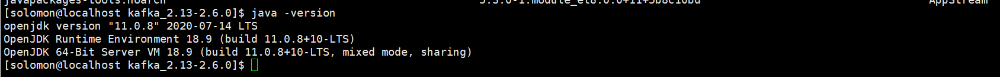
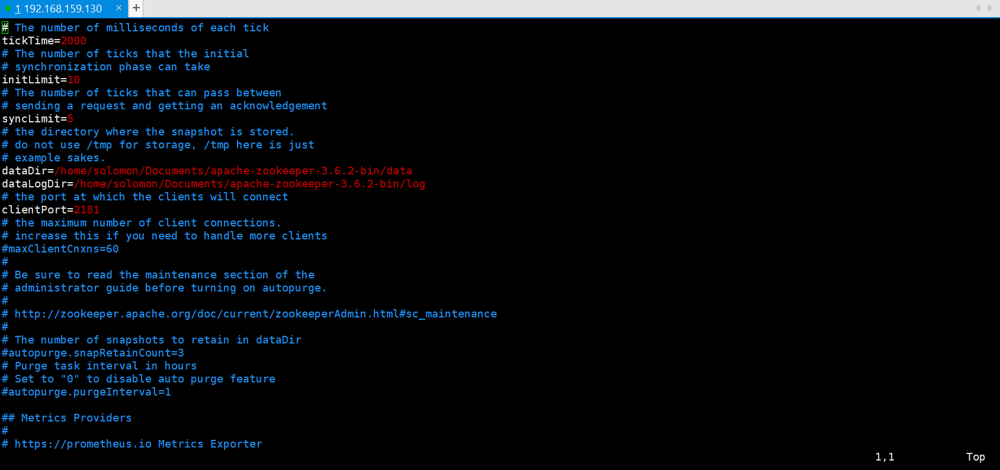
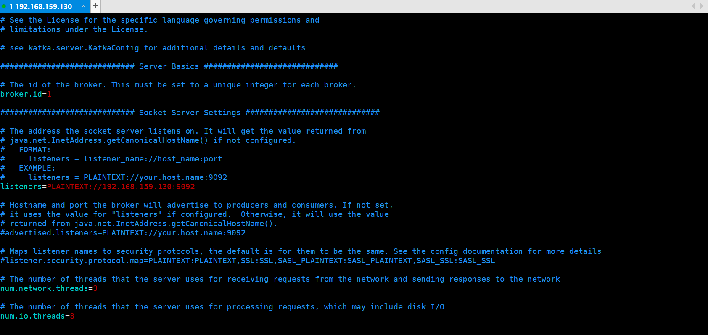
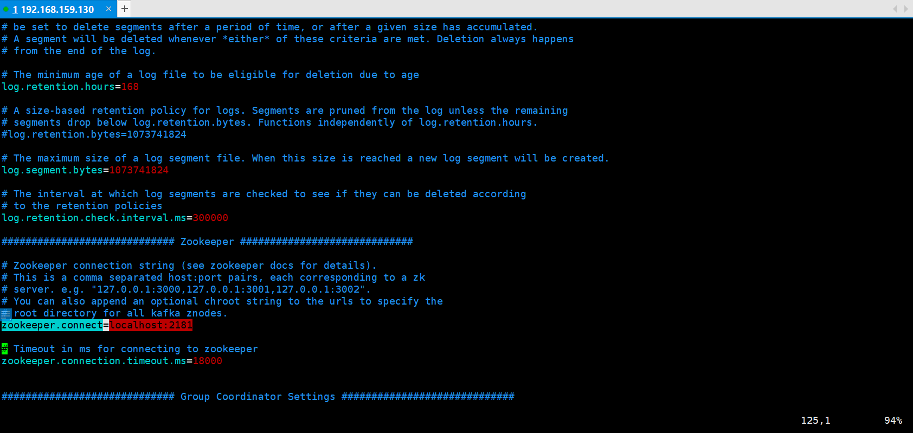

# kafka学习笔记-learning1

## 环境安装（Linux上的安装使用）

### 环境及软件版本

* LINUX : CentSO-8.2.2004-x86_64
* JDK : 11.0.8
* Zookeeper : 3.6.2
  下载地址：<https://mirror.bit.edu.cn/apache/zookeeper/zookeeper-3.6.2/apache-zookeeper-3.6.2-bin.tar.gz>
* kafka : 2.13-2.6.0
  下载地址：<https://mirror.bit.edu.cn/apache/kafka/2.6.0/kafka_2.12-2.5.0.tgz>

### 软件安装

* Java 安装

  ```shell
  yum install java-11-openjdk-devel.x86_64
  ```

  检查安装情况
  
* 安装zookeeper
  
  到安装包目录下执行命令
  
  ```shell
  tar -zxvf apache-zookeeper-3.6.2-bin.tar.gz
  ```

  zookeeper 配置

  ```shell
  cp zoo_sample.cfg zoo.cfg
  vi zoo.cfg
  ```

  修改dataDir, dataLogDir
  

  启动命令

  ```shell
  ./zkServer.sh start
  ```

  检查安装命令

  ```shell
  ./zkServer.sh status
  ```

  运行结果如下
  
  
* 安装Kafka

  + 到安装包目录下执行命令

    ```shell
    tar -xvf kafka_2.13-2.6.0.tgz
    ```

  + kafka配置文件

    ```shell
    cd config
    vi server.properties
    ```

  + 修改如下

    ```shell
      broker.id=1 #三台机器的id分别为1，2，3
      listeners=PLAINTEXT://192.168.56.130:9092 #设置为每台机器各自的IP
      log.dirs=/tmp/kafka-logs
      offsets.topic.replication.factor=3
      transaction.state.log.replication.factor=3
      transaction.state.log.min.isr=1
      zookeeper.connect=localhost:2181
    ```

    
    

  + 启动
    进入安装目录

    ```shell
    ./bin/kafka-server-start.sh -daemon config/server.properties
    ```

  + 查看状态
    

* Kafka 常用命令工具

  + 创建Topic

    创建一个Topic，使用一个partiton

    ```shell
     bin/kafka-topics.sh --bootstrap-server 192.168.159.130:9092 --create  --topic myTopic
    ```

    

  - 查看创建的Topic

    ```shell
    bin/kafka-topics.sh --bootstrap-server 192.168.159.130:9092 --describe  --topic myTopic
    ```

    

  - 生产者
  
    发送消息进入消息模式
    可以向队列输入消息

    ```shell
    bin/kafka-console-producer.sh --bootstrap-server 192.168.159.130:9092  --topic myTopic
    ```

    

  - 消费者
  
    接收队列里的消息

    ```shell
     bin/kafka-console-consumer.sh --bootstrap-server 192.168.159.130:9092  --topic myTopic
    ```

    