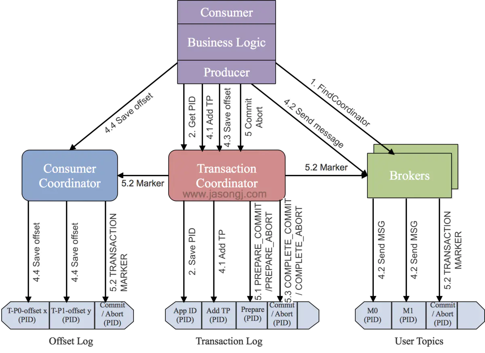

# Kafka 学习笔记

## Kafka事务特性详解

### 概要

- Kafka事务的使用
- Kafka事务配置
- Kafka事务特性
- 总结

#### Kafka事务的使用

Kafka在0.11版本中除了引入了Exactly Once语义，还引入了事务特性。Kafka事务特性是指一系列的生产者生产消息和消费者提交偏移量的操作在一个事务中，或者说是一个原子操作，生产消息和提交偏移量同时成功或者失败。

Kafka中的事务特性主要用于以下两种场景：

- 生产者发送多条消息可以封装在一个事务中，形成一个原子操作。多条消息要么都发送成功，要么都发送失败。

- `read-process-write`模式：将消息消费和生产封装在一个事务中，形成一个原子操作。在一个流式处理的应用中，常常一个服务需要从上游接收消息，然后经过处理后送达到下游，这就对应着消息的消费和生成。
  
> 当事务中仅仅存在Consumer消费消息的操作时，它和Consumer手动提交Offset并没有区别。因此单纯的消费消息并不是Kafka引入事务机制的原因，单纯的消费消息也没有必要存在于一个事务中。

Kafka producer API提供了以下接口用于事务操作：
```java
/**
     * 初始化事务
     */
    public void initTransactions();
 
    /**
     * 开启事务
     */
    public void beginTransaction() throws ProducerFencedException ;
 
    /**
     * 在事务内提交已经消费的偏移量
     */
    public void sendOffsetsToTransaction(Map<TopicPartition, OffsetAndMetadata> offsets, 
                                         String consumerGroupId) throws ProducerFencedException ;
 
    /**
     * 提交事务
     */
    public void commitTransaction() throws ProducerFencedException;
 
    /**
     * 丢弃事务
     */
    public void abortTransaction() throws ProducerFencedException ;
```
下面是使用Kafka事务特性的例子，这段代码Producer开启了一个事务，然后在这个事务中发送了两条消息。这两条消息要么都发送成功，要么都失败。
```java
KafkaProducer producer = createKafkaProducer(
  "bootstrap.servers", "localhost:9092",
  "transactional.id”, “my-transactional-id");

producer.initTransactions();
producer.beginTransaction();
producer.send("outputTopic", "message1");
producer.send("outputTopic", "message2");
producer.commitTransaction();
```

下面这段代码即为read-process-write模式，在一个Kafka事务中，同时涉及到了生产消息和消费消息。

```java
KafkaProducer producer = createKafkaProducer(
  "bootstrap.servers", "localhost:9092",
  "transactional.id", "my-transactional-id");

KafkaConsumer consumer = createKafkaConsumer(
  "bootstrap.servers", "localhost:9092",
  "group.id", "my-group-id",
  "isolation.level", "read_committed");

consumer.subscribe(singleton("inputTopic"));

producer.initTransactions();

while (true) {
  ConsumerRecords records = consumer.poll(Long.MAX_VALUE);
  producer.beginTransaction();
  for (ConsumerRecord record : records)
    producer.send(producerRecord(“outputTopic”, record));
  producer.sendOffsetsToTransaction(currentOffsets(consumer), group);  
  producer.commitTransaction();
}
```

注意：在理解消息的事务时，一直处于一个错误理解是，把操作db的业务逻辑跟操作消息当成是一个事务，如下所示：

```java
void  kakfa_in_tranction(){
  // 1.kafa的操作：读取消息或生产消息
  kafkaOperation();
  // 2.db操作
  dbOperation();
}
```

其实这个是有问题的。操作DB数据库的数据源是DB，消息数据源是kfaka，这是完全不同两个数据。一种数据源（如mysql，kafka）对应一个事务，所以它们是两个独立的事务。kafka事务指kafka一系列 生产、消费消息等操作组成一个原子操作，db事务是指操作数据库的一系列增删改操作组成一个原子操作。

#### Kafka事务配置

- 对于Producer，需要设置`transactional.id`属性，这个属性的作用下文会提到。设置了`transactional.id`属性后，`enable.idempotence`属性会自动设置为`true`。

- 对于Consumer，需要设置`isolation.level = read_committed`，这样Consumer只会读取已经提交了事务的消息。另外，需要设置`enable.auto.commit = false`来关闭自动提交`Offset`功能。
  
#### Kafka事务特性

Kafka的事务特性本质上代表了三个功能：原子写操作，拒绝僵尸实例（Zombie fencing）和读事务消息。

- 原子写
  Kafka的事务特性本质上是支持了Kafka跨分区和Topic的原子写操作。在同一个事务中的消息要么同时写入成功，要么同时写入失败。我们知道，Kafka中的Offset信息存储在一个名为`_consumed_offsets`的Topic中，因此`read-process-write`模式，除了向目标Topic写入消息，还会向`_consumed_offsets`中写入已经消费的`Offsets`数据。因此`read-process-write`本质上就是跨分区和Topic的原子写操作。Kafka的事务特性就是要确保跨分区的多个写操作的原子性。

- 拒绝僵尸实例（Zombie fencing）
  在分布式系统中，一个instance的宕机或失联，集群往往会自动启动一个新的实例来代替它的工作。此时若原实例恢复了，那么集群中就产生了两个具有相同职责的实例，此时前一个instance就被称为“僵尸实例（Zombie Instance）”。在Kafka中，两个相同的producer同时处理消息并生产出重复的消息`read-process-write`模式，这样就严重违反了Exactly Once Processing的语义。这就是僵尸实例问题。

  > Kafka事务特性通过transaction-id属性来解决僵尸实例问题。所有具有相同transaction-id的Producer都会被分配相同的pid，同时每一个Producer还会被分配一个递增的epoch。Kafka收到事务提交请求时，如果检查当前事务提交者的epoch不是最新的，那么就会拒绝该Producer的请求。从而达成拒绝僵尸实例的目标。

- 读事务消息
  为了保证事务特性，Consumer如果设置了`isolation.level = read_committed`，那么它只会读取已经提交了的消息。在Producer成功提交事务后，Kafka会将所有该事务中的消息的`Transaction Marker`从`uncommitted`标记为`committed`状态，从而所有的`Consumer`都能够消费。

#### Kafka事务原理
Kafka为了支持事务特性，引入一个新的组件：Transaction Coordinator。主要负责分配pid，记录事务状态等操作。下面时Kafka开启一个事务到提交一个事务的流程图：


主要分为以下步骤：

- 查找Tranaction Corordinator
  Producer向任意一个brokers发送 `FindCoordinatorRequest`请求来获取`Transaction Coordinator`的地址。

- 初始化事务 initTransaction
  Producer发送InitpidRequest给Transaction Coordinator，获取pid。Transaction Coordinator在Transaciton Log中记录这<TransactionId,pid>的映射关系。另外，它还会做两件事：

  - 恢复（Commit或Abort）之前的Producer未完成的事务
  - 对PID对应的epoch进行递增，这样可以保证同一个app的不同实例对应的PID是一样，而epoch是不同的。

> 只要开启了幂等特性即必须执行InitpidRequest，而无须考虑该Producer是否开启了事务特性。

- 开始事务beginTransaction
  执行Producer的beginTransacion()，它的作用是Producer在本地记录下这个transaction的状态为开始状态。这个操作并没有通知Transaction Coordinator，因为Transaction Coordinator只有在Producer发送第一条消息后才认为事务已经开启。

- read-process-write流程
  一旦Producer开始发送消息，Transaction Coordinator会将该<Transaction, Topic, Partition>存于Transaction Log内，并将其状态置为BEGIN。另外，如果该<Topic, Partition>为该事务中第一个<Topic, Partition>，Transaction Coordinator还会启动对该事务的计时（每个事务都有自己的超时时间）。

  在注册<Transaction, Topic, Partition>到Transaction Log后，生产者发送数据，虽然没有还没有执行commit或者abort，但是此时消息已经保存到Broker上了。即使后面执行abort，消息也不会删除，只是更改状态字段标识消息为abort状态。

- 事务提交或终结 `commitTransaction/abortTransaction`
在Producer执行commitTransaction/abortTransaction时，Transaction Coordinator会执行一个两阶段提交：

  - 第一阶段，将`Transaction Log`内的该事务状态设置为`PREPARE_COMMIT`或`PREPARE_ABORT`
  - 第二阶段，将`Transaction Marker`写入该事务涉及到的所有消息（即将消息标记为committed或aborted）。这一步骤`Transaction Coordinator`会发送给当前事务涉及到的每个<Topic, Partition>的Leader，Broker收到该请求后，会将对应的`Transaction Marker`控制信息写入日志。

> 一旦Transaction Marker写入完成，Transaction Coordinator会将最终的COMPLETE_COMMIT或COMPLETE_ABORT状态写入Transaction Log中以标明该

#### 总结

- Transaction Marker与PID提供了识别消息是否应该被读取的能力，从而实现了事务的隔离性。
- Offset的更新标记了消息是否被读取，从而将对读操作的事务处理转换成了对写`Offset`操作的事务处理。
- Kafka事务的本质是，将一组写操作（如果有）对应的消息与一组读操作（如果有）对应的Offset的更新进行同样的标记`Transaction Marker`来实现事务中涉及的所有读写操作同时对外可见或同时对外不可见。
- Kafka只提供对Kafka本身的读写操作的事务性，不提供包含外部系统的事务性。
