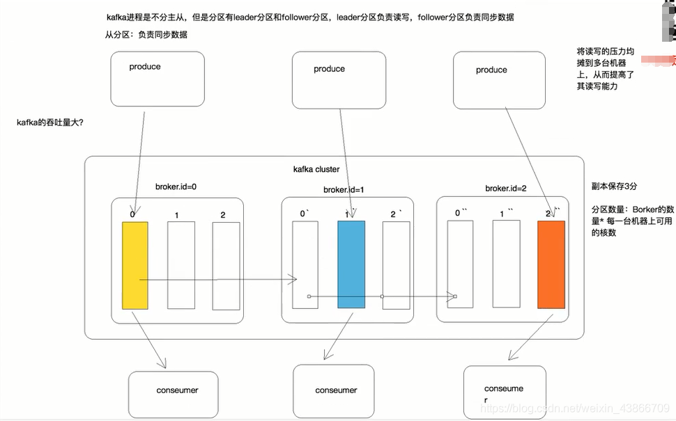

# Kafka 学习笔记

## kafka 集群环境搭建

### 准备环境

* 架构图
* 3台虚拟机器
* 安装软件
* 搭建Kafka
  
#### 架构图



#### 虚拟机准备

* VMware CentOS 8 三台主机
* 修改3台虚拟机的网络配置
  | 配置项 | 参数 |
  | ----| ----|
  |DEVICE   |  接口名（设备,网卡）|
  |USERCTL  |  [yes|no]（非root用户是否可以控制该设备）
  |BOOTPROTO | IP的配置方法[none|static|bootp|dhcp]（引导时不使用协议|静态分配IP|BOOTP协议|DHCP协议）|
  |HWADDR   |   MAC地址 |  
  |ONBOOT   |  系统启动的时候网络接口是否有效（yes/no）|
  |TYPE    |   网络类型（通常是Ethemet）|
  |NETMASK  |  网络掩码|
  |IPADDR   |  IP地址  |
  |IPV6INIT  | IPV6是否有效（yes/no）|
  |GATEWAY   | 默认网关IP地址|
  |BROADCAST | 广播地址|
  |NETWORK   | 网络地址|

  ```shell
    vi /etc/sysconfig/network-scripts/ifcfg-ens33
  ```

  修改主机一配置

  ```shell
    #static assignment
    NM_CONTROLLED=no #表示该接口将通过该配置文件进行设置，而不是通过网络管理器进行管理
    ONBOOT=yes #开机启动
    BOOTPROTO=static #静态IP
    IPADDR=192.168.159.130 #本机地址
    NETMASK=255.255.255.0 #子网掩码
    GATEWAY=192.168.159.2 #默认网关
    DNS1=8.8.8.8
    DNS2=8.8.4.4

    #########end设置静态地址例子#########
  ```

  
  修改主机二配置

  ```shell
    #static assignment
    NM_CONTROLLED=no #表示该接口将通过该配置文件进行设置，而不是通过网络管理器进行管理
    ONBOOT=yes #开机启动
    BOOTPROTO=static #静态IP
    IPADDR=192.168.159.131 #本机地址
    NETMASK=255.255.255.0 #子网掩码
    GATEWAY=192.168.159.2 #默认网关
    DNS1=8.8.8.8
    DNS2=8.8.4.4

    #########end设置静态地址例子#########
  ```

  
  修改主机三配置

  ```shell
    #static assignment
    NM_CONTROLLED=no #表示该接口将通过该配置文件进行设置，而不是通过网络管理器进行管理
    ONBOOT=yes #开机启动
    BOOTPROTO=static #静态IP
    IPADDR=192.168.159.132 #本机地址
    NETMASK=255.255.255.0 #子网掩码
    GATEWAY=192.168.159.2 #默认网关
    DNS1=8.8.8.8
    DNS2=8.8.4.4
    
    #########end设置静态地址例子#########
  ```

  
* 修改主机名

    ```shell
        hostnamectl set-hostname localhost.localdomain
    ```

    
* 修改hosts文件
    

#### 安装软件

* JDK 安装

 + 查询现有系统JDK版本

    ```shell
    rpm -qa | grep jdk
    rpm -qa | grep java
    ```

  + 卸载当前版本
  
    ```shell
    yum -y remove java*
    ```

  + 更新yum 源
  
    

  + 列出 jdk 所有大版本
  
    ```shell
    yum list java*
    ```

    

  + 列出 jdk 所有大版本和子版本
  
    ```shell
    yum --showduplicate list java* | grep 1.8.0

    yum search java | grep jdk
    ```

  + 安装jdk-11

    ```shell
    yum -y install java-11-openjdk-devel.x86_64
    ```

  + 检查安装及版本
  
    ```shell
    java -version
    ```

    

* 安装zookeeper
  
  + 下载zookeeper 安装包

  下载地址：<https://mirror.bit.edu.cn/apache/zookeeper/zookeeper-3.6.2/apache-zookeeper-3.6.2-bin.tar.gz>

  + 解压
  
    ```shell
     tar -zxvf apache-zookeeper-3.6.2-bin.tar.gz
    ```

  + 修改配置文件

    | 配置| 含义 |
    | ----| ----|
    |tickTime|基本事件单元，这个时间是作为Zookeeper服务器之间或客户端与服务器之间维持心跳的时间间隔，每隔tickTime时间就会发送一个心跳；最小 的session过期时间为2倍tickTime|
    |dataDir|存储内存中数据库快照的位置，除非另有说明，否则指向数据库更新的事务日志。注意：应该谨慎的选择日志存放的位置，使用专用的日志存储设备能够大大提高系统的性能，如果将日志存储在比较繁忙的存储设备上，那么将会很大程度上影像系统性能。|
    |client|监听客户端连接的端口。|
    |initLimit|允许follower连接并同步到Leader的初始化连接时间，以tickTime为单位。当初始化连接时间超过该值，则表示连接失败。|
    |syncLimit|表示Leader与Follower之间发送消息时，请求和应答时间长度。如果follower在设置时间内不能与leader通信，那么此follower将会被丢弃。|
    |server.A=B:C:D|A：其中 A 是一个数字，表示这个是服务器的编号；B：是这个服务器的 ip 地址；C：Leader选举的端口；D：Zookeeper服务器之间的通信端口。|

    ```shell
    cp zoo_sample.cfg zoo.cfg
    vi zoo.cfg
    ```

    增加配置

    ```shell
    # 增加
    dataDir=/home/solomon/Documents/apache-zookeeper-3.6.2-bin/data
    dataLogDir=/home/solomon/Documents/apache-zookeeper-3.6.2-bin/log
    clientPort=2181
    server.1=192.168.159.130:2888:3888
    server.2=192.168.159.131:2888:3888
    server.3=192.168.159.132:2888:3888
    4lw.commands.whitelist=*
    ```

    
  + 创建myid文件

    服务器130

    ```shell
     touch myid
     echo 1 > myid
     cat myid  
    ```

    
    服务器131

    ```shell
     touch myid
     echo 2 > myid
     cat myid  
    ```

    
    服务器132

    ```shell
     touch myid
     echo 3 > myid
     cat myid  
    ```

    

   + 启动三台服务器上zookeeper

    ```shell
    ./zkServer.sh start
    ```

    服务状态检查，命令

    ```shell
    ./zkServer.sh status
    ```

     

#### 搭建Kafka

* 安装
  
  + 下载Kafka安装包

    下载地址:<https://mirror.bit.edu.cn/apache/kafka/2.6.0/kafka_2.12-2.5.0.tgz>
  
  + 解压
  
    ```shell
    tar -xvf kafka_2.13-2.6.0.tgz
    ```

  + 创建数据目录
  
    ```shell
    mkdir -p /home/solomon/Documents/kafka_2.13-2.6.0/data
    ```

* 修改配置文件

    broker中的配置只有3个参数是必须提供的：broker.id，log,dir, zookeeper.connect.
    |参数| 介绍|
    |----|----|
    |broker.id|用于区分broker，确保每台机器不同,要求是正数。当该服务器的IP地址发生改变时，broker.id没有变化，则不会影响consumers的消息情况|
    |log.dirs|kafka用于放置消息的目录，默认为/tmp/kafka-logs。它可以是以逗号分隔的多个目录，创建新分区时，默认会选择存在最少分区的目录|
    |zookeeper.connect|zk用于放置kafka信息的地方。注意一般情况下，直接使用ip1:2181,ip2:2181,ip3:2181即可，此时kafka的相关信息会放在zk的根目录下，但如果这个zk集群同时为多个kafka集群，或者其它集群服务，则信息会很混乱，甚至有冲突。因此一般会建一个目录用于放置kafka集群信息的目录，此处的目录为/kafka。注意，这个目录必须手工创建，kafka不会自动创建这个目录。此外，在conusmer中也必须使用ip1:2181,ip2:2181,ip3:2181/kafka来读取topic内容。|
    |num.partitions|创建topic时，默认的分区数|
    |num.network.threads|broker用于处理网络请求的线程数，如不配置默认为3|
    |zookeeper.connection.timeout.ms|6000|
    |message.max.bytes|1000000000|
    |replica.fetch.max.bytes|1073741824|
    

* Kafka启动
  
    ```shell
    ./bin/kafka-server-start.sh -daemon config/server.properties
    ```

    
