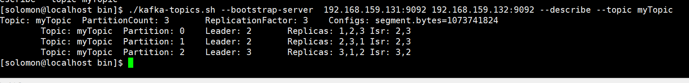

# Kafka 学习笔记

## Kafka集群原理及测试

### 启动应用

* 启动zookeeper

  ```shell
    #启动
    ./zkServer.sh start
    #查看服务
    ./zkServer.sh status
  ```

  

* 启动Kafka
  
  ```shell
    ./kafka-server-start.sh -daemon ../config/server.properties
  ```

  

### 集群选举

* 使用 Zookeeper 来维护集群成员 (brokers) 的信息。每个 broker 都有一个唯一标识`broker.id`, 用于标识自己在集群中的身份，可以在配置文件 `server.properties` 中进行配置；
  
* 每一个 broker 启动的时候，它会在 Zookeeper 的 ·/brokers/ids· 路径下创建一个 临时节点，并将自己的 broker.id 写入，从而将自身注册到集群；
  

* 当有多个 broker 时，所有 broker 会竞争性地在 Zookeeper 上创建 /controller 节点，由于 Zookeeper 上的节点不会重复，所以必然只会有一个 broker 创建成功，此时该 broker 称为 controller broker。它除了具备其他 broker 的功能外，还负责管理主题分区及其副本的状态；
   

* 当 broker 出现宕机或者主动退出从而导致其持有的 Zookeeper 会话超时时，会触发注册在 Zookeeper 上的 watcher 事件，此时 Kafka 会进行相应的容错处理；如果宕机的是 controller broker 时，还会触发新的 controller 选举；
  
### 副本机制

保证高可用，kafka 的分区是多副本的，如果一个副本丢失了，那么还可以从其他副本中获取分区数据。但是这要求对应副本的数据必须是完整的，这是 Kafka 数据一致性的基础，所以才需要使用 `controller broker`来进行专门的管理。下面将详解介绍 Kafka 的副本机制。

* 分区和副本
  
  Kafka 的主题被分为多个分区 ，分区是 Kafka 最基本的存储单位。每个分区可以有多个副本 (可以在创建主题时使用 `replication-factor` 参数进行指定)。其中一个副本是首领副本 (Leader replica)，所有的事件都直接发送给首领副本；其他副本是跟随者副本 (Follower replica)，需要通过复制来保持与首领副本数据一致，当首领副本不可用时，其中一个跟随者副本将成为新首领。
  
  
* ISR机制
  
  每个分区都有一个 ISR(in-sync Replica) 列表，用于维护所有同步的、可用的副本。首领副本必然是同步副本，而对于跟随者副本来说，它需要满足以下条件才能被认为是同步副本：

  * 与 Zookeeper 之间有一个活跃的会话，即必须定时向 Zookeeper 发送心跳；在规定的时间内从首领副本那里低延迟地获取过消息。如果副本不满足上面条件的话，就会被从 ISR 列表中移除，直到满足条件才会被再次加入。

  * 这里给出一个主题创建的示例：使用 `--replication-factor` 指定副本系数为 3，创建成功后使用 --describe 命令可以看到分区 0 的有 0,1,2 三个副本，且三个副本都在 ISR 列表中，其中 1 为首领副本。
  

* 不完全的首领选举
  
  对于副本机制，在 broker 级别有一个可选的配置参数 `unclean.leader.election.enable`，默认值为 `fasle`，代表禁止不完全的首领选举。这是针对当首领副本挂掉且 ISR 中没有其他可用副本时，是否允许某个不完全同步的副本成为首领副本，这可能会导致数据丢失或者数据不一致，在某些对数据一致性要求较高的场景，这可能无法容忍的，所以其默认值为 false，如果你能够允许部分数据不一致的话，可以配置为 true。

* 最少同步副本

  ISR 机制的另外一个相关参数是 `min.insync.replicas` , 可以在 broker 或者主题级别进行配置，代表 ISR 列表中至少要有几个可用副本。这里假设设置为 2，那么当可用副本数量小于该值时，就认为整个分区处于不可用状态。此时客户端再向分区写入数据时候就会抛出异常。

#### 分区分配

在创建主题时，Kafka 会首先决定如何在 broker 间分配分区副本，它遵循以下原则：

在所有 broker 上均匀地分配分区副本；
确保分区的每个副本分布在不同的 broker 上；
如果使用了 broker.rack 参数为 broker 指定了机架信息，那么会尽可能的把每个分区的副本分配到不同机架的 broker 上，以避免一个机架不可用而导致整个分区不可用。
基于以上原因，如果你在一个单节点上创建一个 3 副本的主题，通常会抛出下面的异常：

```java
Error while executing topic command : org.apache.kafka.common.errors.InvalidReplicationFactor
Exception: Replication factor: 3 larger than available brokers: 1.
```

#### 分区数据保留规则

保留数据是 Kafka 的一个基本特性， 但是 Kafka 不会一直保留数据，也不会等到所有消费者都读取了消息之后才删除消息。相反， Kafka 为每个主题配置了数据保留期限，规定数据被删除之前可以保留多长时间，或者清理数据之前可以保留的数据量大小。分别对应以下四个参数：
|参数|详细|
|----|----|
|log.retention.bytes：|删除数据前允许的最大数据量；默认值-1，代表没有限制；|
|log.retention.ms：|保存数据文件的毫秒数，如果未设置，则使用 log.retention.minutes 中的值，默认为 null；|
|log.retention.minutes：|保留数据文件的分钟数，如果未设置，则使用 log.retention.hours 中的值，默认为 null；|
|log.retention.hours：|保留数据文件的小时数，默认值为 168，也就是一周。|
因为在一个大文件里查找和删除消息是很费时的，也很容易出错，所以 Kafka 把分区分成若干个片段，当前正在写入数据的片段叫作活跃片段。活动片段永远不会被删除。如果按照默认值保留数据一周，而且每天使用一个新片段，那么你就会看到，在每天使用一个新片段的同时会删除一个最老的片段，所以大部分时间该分区会有 7 个片段存在。

#### 文件格式

保存在磁盘上的数据格式与生产者发送过来消息格式是一样的。 如果生产者发送的是压缩过的消息，那么同一个批次的消息会被压缩在一起，被当作“包装消息”进行发送 (格式如下所示) ，然后保存到磁盘上。之后消费者读取后再自己解压这个包装消息，获取每条消息的具体信息。


#### 测试高可用

* “leader”是负责给定分区所有读写操作的节点。每个节点都是随机选择的部分分区的领导者。

* “replicas”是复制分区日志的节点列表，不管这些节点是leader还是仅仅活着。

* “isr”是一组“同步”replicas，是replicas列表的子集，它活着并被指到leader。
  
* Broker 1 现在是 leader，让我们来杀了它
  

* 选主
 

* 测试
  
  
