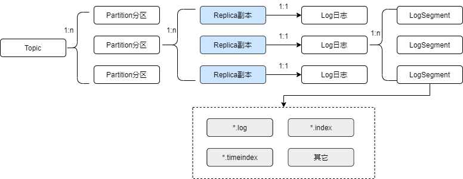
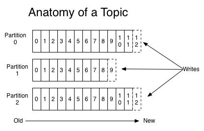
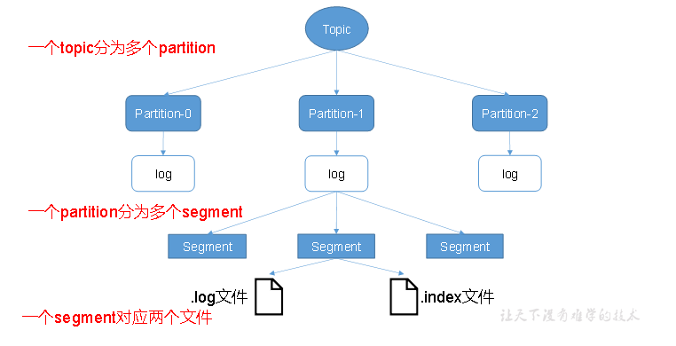
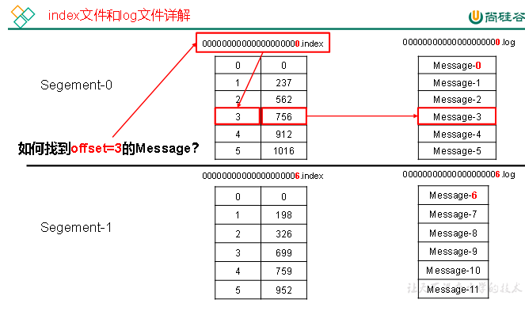

# Kafka 学习笔记

## Kafka 日志记录方式

### 目录

- Kafka数据写入

- 顺序性

- Kafka数据读取

- 索引

- 清理数据
  
### Kafka数据写入

Kafka是将消息写到磁盘上，以log后缀的文件中。

#### log文件

- Kafka每个分区副本对应各自的log日志，log日志又分为多个日志段LogSegment。

- LOG和LogSegment都是逻辑概念，不对应具体文件。

- 一个LogSegment由真实的日志文件、索引文件等组成。

  - 日志文件.log结尾

  - 偏移量索引文件 .index结尾

  - 时间戳索引文件 .timeIndex结尾

#### 文件结构

对于日志来说，一条记录以"\n"结尾，或者通过其它特定的分隔符分隔，这样就可以从文件中拆分出一条一条的记录，不过这种格式更适用于文本，对于Kafka来说，需要的是二进制的格式;



**各个部分的含义是:**
|Field|Description|
|----|----|
|Attributes|This byte holds metadata attributes about the message. The lowest 2 bits contain the compression codec used for the message. The other bits should be set to 0.|
|Crc|The CRC is the CRC32 of the remainder of the message bytes. This is used to check the integrity of the message on the broker and consumer.|
|Key|The key is an optional message key that was used for partition assignment. The key can be null.|
|MagicByte|This is a version id used to allow backwards compatible evolution of the message binary format. The current value is 0.|
|Offset|This is the offset used in kafka as the log sequence number. When the producer is sending messages it doesn't actually know the offset and can fill in any value here it likes.|
|Value|The value is the actual message contents as an opaque byte array. Kafka supports recursive messages in which case this may itself contain a message set. The message can be null.|

- v0版， Record、MessageSet.
- v1版，在v0基础上增加时间戳（CreateTime、LogAppendTime）、消息压缩（GZIP、SNAPPY、LZ4）.
- v2版，Record Batch.

### 顺序性

Kafka在一个分区上文件是顺序读写，磁盘的顺序读写速度能和内存持平。每次读写都会寻址->写入，其中寻址是一个“机械动作”，它是最耗时的。所以硬盘最讨厌随机I/O，最喜欢顺序I/O。为了提高读写硬盘的速度，Kafka就是使用顺序I/O。

**顺序读写的好处**

+ 顺序写入磁盘顺序读写速度某些条件下会超过内存随机读写。
+ 顺序写入系统,即使服务重新启动，缓存依旧可用

下图就展示了Kafka是如何写入数据的， 每一个Partition其实都是一个文件 ，收到消息后Kafka会把数据插入到文件末尾


### Kafka数据读取

数据读取时候kafka进行了数据的批量压缩结合ZeroCopy技术进行的优化。

- 将多条消息打包（批量压缩）后进行进行发送数据。从发送到存储在磁盘都是压缩格式，直到消费者消费才进行解压

- broker、consumer、producer同样使用标准二进制格式数据，使得数据不需要修改就可以进行数据传递。

- sendfile结合pagecache实现零拷贝
  


### 索引

日志文件与索引文件的文件名以该LogSegment中的第一条消息的offset命名，用0填充的20位数字（即baseOffset基准偏移量）


**LogSegment切分，满足以下任一条件则进行切分:**

- 索引文件大小大于
  `log.index.size.max.bytes`配置 （默认10M）
- 消息的最大时间戳与系统时间差值大于`log.roll.ms`或`log.roll.hours` （默认7天）
- 文件大小超过`log.segment.bytes`参数的配置 （默认1G）

#### 偏移量索引

每个索引项占8个字节
- 相对偏移量（relative offset）消息相对于baseOffset的偏移量，即offset-baseOffset，4字节
- 物理位置 （position）消息在日志文件中的物理位置，4字节
可用kafka-dump-log.sh工具查看

#### 时间戳索引

每个索引项占12个字节
当前日志分段中最大的时间戳，8字节
相对偏移量（relative offset）时间戳所对应消息的相对偏移量
- 查找方式，例查找指定时间戳之后的数据目标时间戳与各日志分段的最大时间戳比较，找到第一个不小于目标时间戳的日志分段.
  
- 在该日志分段的时间索引中查找不大于目标时间戳的最大索引项用该时间索引项的相对偏移量,在偏移量索引文件中查找索引项
使用该索引项的物理地址,在日志文件中查找消息.

### 清理数据

因为Kafka写入顺序性因此没有办法删除数据 ，所以Kafka是不会删除数据的，它会把所有partitions的数据都保留下来，这样就涉及到了删除log文件的数据，Kakfa提供了两种策略来删除数据：

- 基于时间 默认配置168小时（7天）
  
  ```shell
  log.retention.hours
  ```

- 基于partition文件大小 默认为1Gb

  ```shell
  log.segment.bytes
  ```
