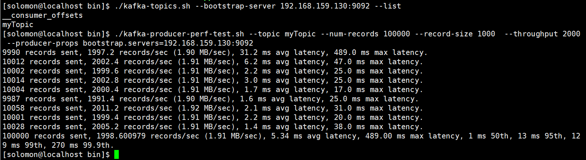

# Kafka 学习笔记

## Kafka 压力测试性能监控

### 目录

- 测试环境
  
- 测试用例
  
- 测试结果
  
#### 测试环境

* 主机

|主机|IP|操作系统|
|----|-----|-----|
|kafka1|192.168.159.130|虚拟机器Linux localhost 4.18.0-193.19.1.el8_2.x86_64 #1 SMP Mon Sep 14 14:37:00 UTC 2020 x86_64 x86_64 x86_64 GNU/Linux|
|kafka2|192.168.159.131|虚拟机器Linux localhost 4.18.0-193.19.1.el8_2.x86_64 #1 SMP Mon Sep 14 14:37:00 UTC 2020 x86_64 x86_64 x86_64 GNU/Linux|
|kafka3|192.168.159.132|虚拟机器Linux localhost 4.18.0-193.19.1.el8_2.x86_64 #1 SMP Mon Sep 14 14:37:00 UTC 2020 x86_64 x86_64 x86_64 GNU/Linux|

* 测试工具

  Kafka压测工具 `kafka-producer-perf-test.sh`  `kafka-consumer-perf-test.sh` 。

* 测试目的
  
  性能测试在正式环境下单台服务器上Kafka处理MQ消息能力进行压力测试。测试包括对Kafka写入MQ消息和消费MQ消息进行压力测试，根据10w、100w和1000w级别的消息处理结果，评估Kafka的处理性能是否满足项目需求。（该项目期望Kafka能够处理上亿级别的MQ消息）

#### 测试用例

+ 写入单broker
  
|测试场景|MQ消息数|每秒写入消息数|记录大小(单位:字节|
|----|----|----|----|
|主机130|100W|5000|1000|

```shell
./kafka-producer-perf-test.sh --topic myTopic --num-records 100000 --record-size 1000  --throughput 2000 --producer-props bootstrap.servers=192.168.159.130:9092
```



```shell
./kafka-consumer-perf-test.sh --broker-list lo192.168.159.130:9092 --topic myTopic --fetch-size 1048576 --messages 100000 --threads 1
```

