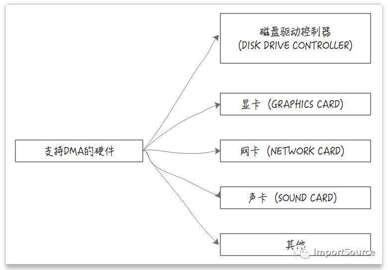

# Kafka 学习笔记

## Kafka  zero-copy 原理

### 前言

Kafka 使用zero copy技术所以无论存储和访问都很快，通过Kafka分析了下列技术：

- NIO
- Zero Copy
- 磁盘顺序读写

#### Kafka如何使用了zero copy

在消息消费的时候 Kafka 使用了 zero copy。

- 传统的文件访问
  传统的文件拷贝通常需要从用户态去转到核心态，经过read buffer，然后再返回到用户态的应用层buffer，然后再从用户态把数据拷贝到核心态的socket buffer，然后发送到网卡。如下图所示：

  

  从上图你会发现，传统的数据传输需要多次的用户态和核心态之间的切换，而且还要把数据复制多次，最终才打到网卡。

- (DMA) Direct Memory Access
  
  Direct Memory Access，一种可让某些硬件子系统去直接访问系统主内存，而不用依赖CPU的计算机系统的功能。听着是不是很厉害，跳过CPU，直接访问主内存。传统的内存访问都需要通过CPU的调度来完成。如下图：

  

  而DMA，则可以绕过CPU，硬件自己去直接访问系统主内存。如下图：

  

  很多硬件都支持DMA，这其中就包括网卡。

  

- 零拷贝
  在有了DMA后，就可以实现绝对的零拷贝了，因为网卡是直接去访问系统主内存的。如下图：

  

#### Java的零拷贝实现

在Java中的零拷贝实现是在FileChannel中，其中有个方法transferTo(position,fsize,src)。

- 传统
  文件传输是通过java.io.DataOutputStream，java.io.FileInputStream来实现的，然后通过while循环来读取input，然后写入到output中。
  
    ```java
    InputStream inputStream = new FileInputStream(new File(fileName));
    OutputStream outPutStream = new DataOutStream();
    byte[] byte = new byte[4096];
    long read = 0 ;
    long total = 0 ;
    while((read = inputStream.read(byte))>=0) {
        total = total + read;
        outputStream.write(byte);
    }
    ```

- 零拷
  通过java.nio.channels.FileChannel中的transferTo方法来实现的。transferTo方法底层是基于操作系统的sendfile这个system call来实现的（不再需要拷贝到用户态了），sendfile负责把数据从某个fd（file descriptor）传输到另一个fd。
  
  
- transferTo实现
  
  ```java
  long fsize = new File(fileName) . size();
  FileChannel fc = new FileInputStream(new File(fileName)).getChannel();
  long sent = 0;
  long cur = 0;
  cur = fc.transferTo(posititon: 0 ,fsize, sc);
  ```

#### 传统方式与零拷贝性能对比

|文件size|传统|zero copy|
|----|----|----|----|
|200M|2120ms|1150ms|
|350M|3631ms|1762ms|
|700M|13498ms|4422ms|

可以看出速度快出至少三倍多。Kafka在文件传输的过程中正是使用了零拷贝技术对文件进行拷贝。建议以后多用FileChannel的transferTo吧。

#### 总结

- 传统的文件传输有多次用户态和内核态之间的切换，而且文件在多个buffer之间要复制多次最终才被发送到网卡。

- DMA是一种硬件直接访问系统主内存的技术。
  
- 多种硬件都已使用了DMA技术，其中就包括网卡（NIC）。
  
- DMA技术让CPU得到解放，让CPU可以不用一直守着来完成文件传输。
  
- 零拷贝技术减少了用户态与内核态之间的切换，让拷贝次数降到最低，从而实现高性能。
  
- Kafka使用零拷贝技术来进行文件的传输。
