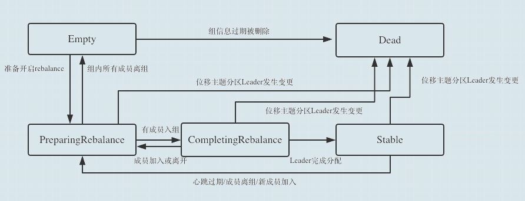

# Kafka 学习笔记

## Kafka rebalance机制和异常

### 概要

- Group 状态机
- Consumer Rebalance
- Group Coordinator
- 总结

#### Group 状态机

- 什么是消费组
  要想了解 rebalance，那就得先了解消费组（consumer group）。
  消费组指的是多个消费者（consumer）组成起来的一个组，它们共同消费 topic 的所有消息，并且一个 topic 的一个 partition 只能被一个 consumer 消费。

  Kafka 为消费者组定义了 5 种状态，它们分别是：`Empty`、`Dead`、`PreparingRebalance`、`CompletingRebalance` 和 `Stable`。

  |状态|含义|
  |----|----|
  |Empty|主内没有任何成员，但消费者可能存在已经提交的位移数据，而且这些位移尚未过期|
  |Dead|主内没有任何成员，但组的元数据信息已经在协调者端被移除，协调者组件保持着当前向他注册过的所有组信息，所谓的元数据信息就类似于这个注册信息|
  |PreparingRebalance|消费者组准备开启重平衡，此时所有成员都要重请求加入消费者组|
  |CompletingRebalance|消费者组下所有成员已经加入，各个成员正等待分配方案，该状态在老一点的版本被称为AwaitingSync,它和CompletingRebalance是等价的。|
  |Stable|消费者组稳定状态，该状态表明重平衡已经完成，组内各成员能够正常消费数据|

- 它展示了状态机的各个状态流转
  

  一个消费者组最开始是 Empty 状态，当重平衡过程开启后，它会被置于 PreparingRebalance 状态等待成员加入，之后变更到 CompletingRebalance 状态等待分配方案，最后流转到 Stable 状态完成重平衡。
  当有新成员加入或已有成员退出时，消费者组的状态从 Stable 直接跳到 PreparingRebalance 状态，此时，所有现存成员就必须重新申请加入组。当所有成员都退出组后，消费者组状态变更为 Empty。Kafka 定期自动删除过期位移的条件就是，组要处于 Empty 状态。因此，如果你的消费者组停掉了很长时间（超过 7 天），那么 Kafka 很可能就把该组的位移数据删除了。我相信，你`在 Kafka 的日志中一定经常看到下面这个输出：

  ```shell
  Removed ✘✘✘ expired offsets in ✘✘✘ milliseconds.
  ```

  这就是 Kafka 在尝试定期删除过期位移。现在你知道了，只有 Empty 状态下的组，才会执行过期位移删除的操作。

#### Consumer Rebalance

对于一个Consumer Group，可能随时都有Consumer加入或者退出这个Consumer Group，Consumer列表的变化势必会引起partition的重新分配，这个为Consumer分配partition的过程就被称为Consumer Rebalance。

***出现任何以下的场景都会触发Consumer Rebalance操作：***

- 有新的消费者加入Consumer Group。
- 有消费者主动退出Consumer Group。
- Consumer Group订阅的任何一个Topic出现分区数量的变化

Kafka提供了两种分配策略：```Range```和```RoundRobin```。

- Range策略
  range策略的具体步骤如下:

  - 对一个topic中的partition进行排序
  - 对消费者按字典进行排序
  - 然后遍历排序后的partition的方式分配给消费者
  举个例子，比如有两个消费者C0和C1，两个topic(t0,t1)，每个topic有三个分区p(0-2)，
  那么采用Range策略，分配出的结果为： 
  `C0: [t0p0, t0p1, t1p0, t1p1]
C1: [t0p2, t1p2]` 

- RoundRobin策略
  配RoundRobin策略和Range策略类型，唯一的区别就是Range策略分配partition时，是按照topic逐次划分的。而RoundRobin策略则是将所有topic的所有分区一起排序，然后遍历partition分给消费者。
  因此，采用RoundRobin策略，分配出的结果为：

  `
  C0: [t0p0, t0p2, t1p1]
  C1: [t0p1, t1p0, t1p2]
  `

#### Group Coordinator

Group Coordinator主要负责Consumer Group的管理，Offset位移管理以及Consumer Rebalance。其中, Consumer Group管理方面，当一个Consumer希望加入某一个Consumer Group时，它会发送一个请求给Group Coordinator。Group Coordinator负责维护一个Consumer Group中所有的Consumer列表，随着Consumer的加入和退出，Coordinator也会随之更新这个列表。

***Group Coordinator是运行在Kafka集群中每一个Broker内的一个进程。
主要负责Consumer Group的管理，Offset位移管理以及Consumer Rebalance。
对于每一个Consumer Group，Group Coordinator都会存储以下信息：***

- 订阅的topics列表
- `Consumer Group`配置信息，包括`session timeout`等
- 组中每个`Consumer`的元数据。包括主机名，`consumer id`
- 每个`Group`正在消费的`topic partition`的当前`offsets`
- `Partition`的`ownership`元数据，包括`consumer`消费的`partitions`映射关系

***第一个加入Consumer Group的Consumer被称为leader***

一旦Consumer Group中的成员发生变化，例如有新的Consumer加入，那么就需要为其分配partition；或者有Consumer退出，那么就需要将其负责消费的partition分配给组内其他成员。因此Consumer Group中的成员发生变化， Group Coordinator就负责发起Consumer Rebalance活动。
值得注意的是，真正的Consumer Rebalance行为是由Consumer Group Leader执行的。Group Leader首先向Coordinator获取Group中的Consumer成员列表，然后根据Rebalance策略，将partition分配给Consumer Group中的成员，再将分配结果告知Coordinator。最后，Coordinator将partition分配结果通知给每一个Consumer。在Consumer Rebalance的过程中，所有的Consumer都不允许消费消息。
***Producer发送消息到Topic时，分配partition的算法如下：***

- 如果指定了一个partition，那么直接使用指定的partition
- 如果没有指定partition，但是指定了key，那么会根据key进行哈希，分配到对应的partition中
- 如果partition和key都没指定，会使用round-robin算法进行分配

#### 总结

- Consumer Groups 用于多个Consumer并行消费消息。为了防止两个消费者重复消费一条消息，Kafka不允许同一个Consumer Group中的两个Consumer读取同一个partition。
- Group Coordinator 用于维护Consumer Group信息。
- Consumer Rebalance 是为Consumer Group中的Consumer分配partition的过程。一旦一个Consumer Group中的成员发生变化，就会触发Rebalance行为。
- Group leader 是第一个加入Consumer Group的 Consumer，它负责Consumer Rebalance的执行。
- Consumer Rebalance策略主要有Range和Round Robin。
